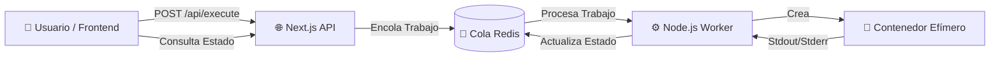

<div align="center">

# ⚡ CodeRunner Engine

### Sistema de Ejecución de Código Remoto (RCE) Distribuido

<p align="center">
  
  
  
</p>

<p align="center">
  
  
  
  
  
</p>

</div>

---

## 📖 Descripción General

**CodeRunner Engine** es una plataforma escalable diseñada para **compilar y ejecutar código de forma segura**, simulando el núcleo del backend de plataformas como **LeetCode** o **HackerRank**.

A diferencia de un script simple con `eval()`, este sistema implementa una **arquitectura Productor-Consumidor**. Desacopla la interfaz web de la lógica de ejecución utilizando una cola de mensajes (Redis), asegurando que el servidor permanezca receptivo incluso bajo alta carga de tráfico. 

### 🔒 Seguridad First

Cada fragmento de código se ejecuta dentro de un **contenedor Docker desechable** con límites estrictos de red y hardware, garantizando que el código no confiable no pueda:
- Acceder al sistema de archivos del host
- Conectarse a internet
- Consumir recursos ilimitados
- Afectar otros procesos del sistema

---

## 🏗️ Arquitectura del Sistema

El sistema consta de **tres microservicios principales** conectados entre sí:



### 🔄 Flujo de Ejecución

1. **Usuario envía código** → El frontend envía una petición POST a `/api/execute`
2. **API encola trabajo** → El servidor Next.js agrega el trabajo a la cola Redis (BullMQ)
3. **Worker procesa** → El worker Node.js toma el trabajo de la cola
4. **Contenedor efímero** → Se crea un contenedor Docker aislado para ejecutar el código
5. **Resultado devuelto** → La salida (stdout/stderr) se almacena en Redis
6. **Frontend consulta** → El usuario recibe el resultado mediante polling

---

## ✨ Características Clave

<table>
<tr>
<td width="50%" valign="top">

### 🛡️ Ejecución en Sandbox
- Utiliza **dockerode** para levantar contenedores aislados
- Sin acceso al sistema de archivos del host
- Sin conexión a internet (`NetworkMode: none`)
- Entorno completamente controlado

### ⚡ Orientado a Eventos
- Construido sobre **BullMQ** (Redis)
- Procesamiento asíncrono de trabajos
- Escalable horizontalmente
- Alta disponibilidad

</td>
<td width="50%" valign="top">

### ⏱️ Límites de Recursos
- **RAM**: Máximo 50MB por ejecución
- **CPU**: Límites estrictos de uso
- Previene bucles infinitos
- Protección contra OOM (Out of Memory)

### 🔄 Feedback en Tiempo Real
- Polling del estado de ejecución
- Resultados instantáneos
- Manejo de errores robusto
- UI reactiva con Monaco Editor

</td>
</tr>
</table>

### 🧹 Limpieza Automática

Implementa un mecanismo de **"Garbage Collection"** que:
- Fuerza la eliminación de contenedores post-ejecución
- Evita el agotamiento de recursos del sistema
- Mantiene el entorno limpio y eficiente
- Previene la acumulación de contenedores zombies

---

## 🛠️ Stack Tecnológico

<div align="center">

| Capa | Tecnologías |
|------|-------------|
| **Frontend** | Next.js 14 (App Router), Tailwind CSS, Monaco Editor |
| **Backend Runtime** | Node.js, TypeScript |
| **Orquestación** | Docker Engine API (dockerode) |
| **Mensajería** | Redis, BullMQ |
| **Contenedores** | Docker |

</div>

---

## 🚀 Instalación y Uso

### 📋 Requisitos Previos

Antes de comenzar, asegúrate de tener instalado:

- ✅ **Docker Desktop** (corriendo)
- ✅ **Node.js 18+**
- ✅ **Redis** (local o en contenedor)

### 📦 Pasos de Instalación

#### 1️⃣ Clonar el repositorio

```bash
git clone https://github.com/AlanMeglio/coderunner-engine.git
cd coderunner-engine
```

#### 2️⃣ Iniciar Infraestructura (Redis)

```bash
docker run -d -p 6379:6379 --name local-redis redis:alpine
```

#### 3️⃣ Instalar Dependencias

```bash
# Dependencias del Backend (Worker)
npm install

# Dependencias del Frontend (Web)
cd web
npm install
```

#### 4️⃣ Ejecutar el Sistema

Necesitas correr el **Worker (Backend)** y el **Frontend (Web)** en terminales separadas.

**Terminal 1: El Worker (Procesador)**
```bash
npx ts-node src/workers/CodeWorker.ts
```

**Terminal 2: El Frontend (Interfaz Web)**
```bash
cd web
npm run dev
```

#### 5️⃣ Acceder a la Aplicación

Abre tu navegador en **http://localhost:3000** y ¡empieza a programar! 🎉

---

## 📂 Estructura del Proyecto

```plaintext
coderunner-engine/
├── src/
│   ├── lib/            # Lógica de Docker (Patrón Singleton)
│   ├── workers/        # Consumidor de BullMQ
│   └── types/          # Interfaces compartidas (TypeScript)
│
├── web/                # Aplicación Next.js
│   ├── src/app/api/    # API Gateway (Productor)
│   └── src/app/        # UI con Monaco Editor
│
├── package.json        # Dependencias del Backend
├── LICENSE             # Licencia MIT
└── README.md           # Este archivo
```

---

## 🎯 Casos de Uso

Este sistema es ideal para:

- 📚 **Plataformas educativas** que necesitan evaluar código de estudiantes
- 💼 **Procesos de reclutamiento técnico** (coding challenges)
- 🏆 **Competencias de programación** online
- 🧪 **Entornos de prueba** para snippets de código
- 🤖 **Chatbots técnicos** que ejecutan código

---

## 🔐 Seguridad

### Medidas Implementadas

- ✅ Contenedores Docker efímeros y aislados
- ✅ Sin acceso a red (`NetworkMode: none`)
- ✅ Límites estrictos de RAM y CPU
- ✅ Sin acceso al sistema de archivos del host
- ✅ Timeout automático para ejecuciones largas
- ✅ Limpieza forzada de recursos

### ⚠️ Advertencias

Este sistema está diseñado para **entornos controlados**. Aunque implementa múltiples capas de seguridad, siempre:
- Monitorea el uso de recursos del servidor
- Configura límites apropiados según tu infraestructura
- Considera implementar rate limiting en producción

---

## 🤝 Contribuciones

Las contribuciones son bienvenidas. Para cambios importantes:

1. Fork el proyecto
2. Crea una rama para tu feature (`git checkout -b feature/NuevaCaracteristica`)
3. Commit tus cambios (`git commit -m 'Agregada nueva característica'`)
4. Push a la rama (`git push origin feature/NuevaCaracteristica`)
5. Abre un Pull Request

---

## 📝 Licencia

Este proyecto está bajo la Licencia MIT. Consulta el archivo [LICENSE](LICENSE) para más detalles.

---

## 👨‍💻 Autor

**Alan Meglio**

- 🌐 LinkedIn: [linkedin.com/in/meglioalan](https://www.linkedin.com/in/meglioalan/)
- 📧 Email: meglioalan@gmail.com
- 🐙 GitHub: [@AlanMeglio](https://github.com/AlanMeglio)

---

<div align="center">

### ⭐ Si este proyecto te resultó útil, considera darle una estrella

**Hecho con ❤️ por Alan Meglio**

</div>
